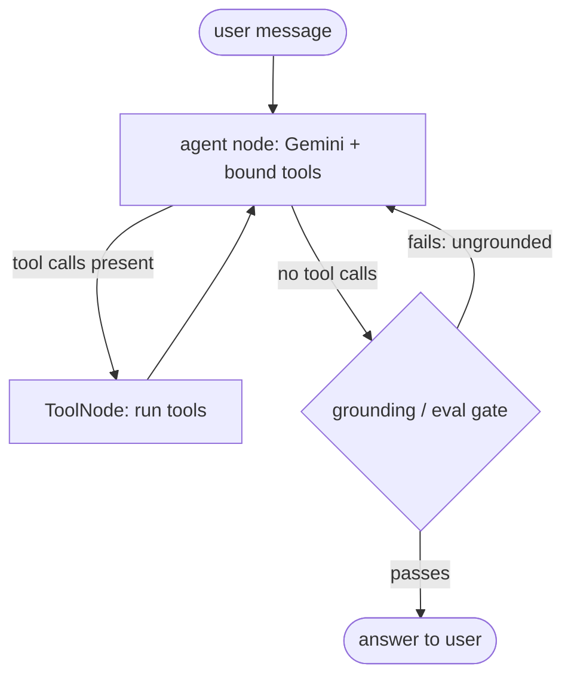

# Commerce Concierge — Design

**Status:** Phase 2a complete (2026-09-17) — a hand-rolled ReAct graph, 4 tools
including FAISS retrieval over a policy corpus, multi-hop tool use, and swappable
offline/live reasoner *and* embeddings (see [README.md](README.md)). Phase 2b in
progress: the grounding gate is wired into the graph (§4.4); durable state, then eval,
then deployment.

---

## 0. TL;DR
An **agentic eCommerce assistant**: a stateful ReAct-style agent that answers shopper
questions ("where's my order?", "is this in stock under $50?", "return policy on opened
items?") by **reasoning over a product/policy corpus (RAG)** and **calling backend
tools**, with an **evaluation gate** that rejects ungrounded answers. Built on
**LangGraph** (orchestration) + **LangChain** (LLM/tools/retrieval) + **Vertex AI
Gemini** (model + embeddings) + **GCP Cloud Run** (deploy). Local-first; nothing hits
cloud billing until it is explicitly enabled.

## 1. Why this project
The interesting part isn't "a chatbot" — it's demonstrating **agent-architecture
judgment on a realistic domain**. It sits on real eCommerce experience, so the design
choices come from having shipped commerce systems, not from a tutorial. The control flow
is an **explicit graph** — a ReAct loop with a conditional tool edge and a grounding
gate — so behavior is auditable rather than "the LLM decides and we hope."

**What it demonstrates:**
> A stateful agentic eCommerce assistant on LangGraph + LangChain with Google Vertex AI
> (Gemini): a ReAct agent that grounds responses on a product/policy corpus (RAG), calls
> order/inventory tools, and gates output with an automated faithfulness eval.

## 2. What it does (scope)
Conversational assistant for a fictional store. Example interactions it handles
end-to-end:
- **Order status** — *"Where's order 10432?"* → `get_order_status` tool → grounded answer.
- **Product + inventory** — *"Do you have the trail runners in blue, size 10, under $120?"* → `search_catalog` + `check_inventory`.
- **Policy Q&A** — *"Can I return shoes I've worn once?"* → RAG over the policy corpus (no tool), cited.
- **Multi-step** — *"I want to return order 10432 — what's the process and will I get a full refund?"* → order lookup + policy retrieval, composed.
- **Refusal / guardrail** — asks outside scope, or where grounding is missing → says so instead of inventing.

Non-goals for the POC: real payment processing, real PII, auth/accounts, a production
catalog. All backends are **mock** (seeded JSON), which keeps it free to run and safe to
open-source.

## 3. Domain model & tools
Mock data (seeded JSON/SQLite): `products` (sku, name, attributes, price), `inventory`
(sku → qty by location), `orders` (id → status, lines, dates), `policies` (returns,
shipping, warranty — as text docs for RAG).

**Tools (LangChain `@tool`):**
| Tool | Signature | Backs onto |
|------|-----------|-----------|
| `search_catalog` | `(query, max_price=None, attrs=None) -> list[Product]` | products |
| `check_inventory` | `(sku, location=None) -> InventoryStatus` | inventory |
| `get_order_status` | `(order_id) -> OrderStatus` | orders |
| `get_policy` | `(topic) -> str` | RAG retriever over policies |

`get_policy` is deliberately a **retrieval tool** so the agent can decide when to ground
vs. when to call a structured tool — that decision *is* the agentic behavior worth
demonstrating.

## 4. Architecture

### 4.1 The LangGraph graph
A ReAct loop: the agent reasons, optionally calls tools, loops until it can answer; a
**grounding-check node** runs before the final answer leaves.



- **State:** `TypedDict` with `messages: Annotated[list, add_messages]` (+ optional `retrieved_docs`, `attempts`).
- **Routing:** `tools_condition` sends to `ToolNode` when the last `AIMessage` has tool calls, else toward the gate.
- **Gate:** a node that checks the drafted answer's claims are supported by tool results / retrieved docs; on failure, loop back (bounded by `attempts`) or emit an honest "I can't confirm that."
- **Persistence:** `checkpointer` keyed by `thread_id` → durable multi-turn memory. `MemorySaver` locally → `SqliteSaver` for the POC → `PostgresSaver` if deployed multi-instance.

Two implementations, both worth having in the repo:
1. **Prebuilt** `create_agent(...)` (v1 location) — the fast path.
2. **Hand-rolled** `StateGraph` (agent node ↔ `ToolNode`, conditional edge, gate node) — makes explicit what the prebuilt hides. This is the version to study.

### 4.2 LangChain + Vertex layer
- **Model:** `ChatGoogleGenerativeAI(model="gemini-2.5-flash", vertexai=True, project=..., location="us-central1")` — the consolidated, current path (see §5). `.bind_tools([...])` for tool calling; `.with_structured_output(...)` for typed extraction where useful.
- **Agent factory:** `from langchain.agents import create_agent` (v1 location).

### 4.3 RAG / grounding
- **Embeddings:** `text-embedding-005` (via `GoogleGenerativeAIEmbeddings(..., vertexai=True)` or `VertexAIEmbeddings`).
- **Vector store:** **FAISS** (in-process, zero infra) for the POC; documented upgrade path to **Vertex AI Vector Search** for the "production" story.
- **Corpus:** the policy docs + product descriptions, chunked. `get_policy` and product-detail answers retrieve from it.
- Optional stretch: Gemini **Google Search grounding** (`bind_tools([{"google_search": {}}])`) — off by default.

### 4.4 Eval & guardrail gate
- **Grounding check (runtime):** the gate node verifies the answer's factual claims trace to tool output / retrieved docs; ungrounded → loop or refuse. A real guardrail, not decoration.
- **Why a gate and not just a score threshold (measured, Phase 2a).** The obvious cheap
  alternative is "refuse when the top retrieval score is low." It does not work, and the
  numbers say so: across 9 in-scope and 7 out-of-scope questions, in-scope top hits scored
  0.188–0.569 and out-of-scope ones 0.000–0.283 — **overlapping** ranges, so no threshold
  separates them. The cause is structural rather than a tuning miss: cosine normalises
  length away, so *short chunks score high on almost anything* (every out-of-scope question
  containing the word "policy" retrieved the same three-line section at ~0.25). Swapping in
  real Gemini embeddings improved *ranking* markedly but did **not** fix abstention —
  "can I pay in bitcoin?" still retrieved a shipping section at 0.588. A similarity score
  answers "what is nearest?", never "does this answer the question?" Those are different
  predicates, and only the second one can be a guardrail. `get_policy` therefore keeps a
  low `_RELEVANCE_FLOOR` as a cheap pre-filter for the obviously-irrelevant tail, and the
  real judgement moves to the gate node.
- **Offline eval harness:** a small **golden set** (~15–20 Q&A with expected tool + grounded answer) + an LLM-as-judge **faithfulness/correctness** score, run as a script/CI gate. Report **precision/recall of tool selection** and a faithfulness score — and note the LLM-judge caveats honestly: position/verbosity/self-preference bias, calibrated against a few human labels.

### 4.5 GCP deployment (only when enabled)
- **Package:** FastAPI app (`/query`, `/health`) → Docker → **Cloud Run** (`gcloud run deploy --source .`), `2Gi`/`120s`/`--workers 1`, `--min-instances 0` (scale to zero = ~no idle cost), `--no-allow-unauthenticated`.
- **Auth:** **ADC** — `gcloud auth application-default login` locally; an **attached service account with `roles/aiplatform.user`** on Cloud Run (the metadata server supplies tokens — **no key files in the repo**).
- **Managed alternative:** **Vertex AI Agent Engine** hosts LangGraph agents directly (sessions/tracing/scaling, no container to operate).

## 5. Current-stack note (the stack hit v1.0 — build against the new APIs)
The ecosystem churned through three renames; older blog posts are **wrong** now. Build
against the current APIs, but know the old names — "I know the class got renamed and why"
is itself a strong signal.

| Concern | Old (deprecation-flagged, still runs) | **New (build on this)** |
|---|---|---|
| Prebuilt agent | `langgraph.prebuilt.create_react_agent`, param `prompt=` | **`langchain.agents.create_agent`, param `system_prompt=`** |
| Vertex chat model | `langchain_google_vertexai.ChatVertexAI` | **`langchain_google_genai.ChatGoogleGenerativeAI(vertexai=True)`** |
| Model id | `gemini-2.5-*` (**shuts down Oct 20 2026**) | **`gemini-3.8-flash`** — verified 2026-09-17 by listing the models the key can actually see and smoke-testing tool-calling on each candidate. Pin an exact id, never a `-latest` alias: an alias silently swaps the reasoner underneath the eval harness and makes regressions unattributable. |
| Embeddings | `text-embedding-005` (Vertex) | **`gemini-embedding-001`** (3072-d, GA on AI Studio) — verified the same way |

Packages: `langchain` (v1), `langgraph` (v1), `langchain-google-genai` (≥4.0); add
`langchain-google-vertexai` **only** for Vertex Vector Search, `langgraph-checkpoint-sqlite`
for durable state. **Pin exact versions with `pip freeze`.**

## 6. Build plan (phased)
1. **Local ReAct MVP** — `ChatGoogleGenerativeAI(vertexai=True)` + 2 tools (`get_order_status`, `search_catalog`) + hand-rolled `StateGraph`, run from a CLI against ADC. *(First real Vertex spend — tiny.)*
2. **RAG + all 4 tools** *(2a — done)* — policy corpus + FAISS retriever + `get_policy` + `check_inventory` + multi-hop tool use + offline/live embeddings.
2b. **The gate + durable state** *(next)* — the grounding-check node + `SqliteSaver`.
3. **Eval harness** — golden set + faithfulness/tool-selection scoring as a script (later a CI gate).
4. **Deploy** — FastAPI + Dockerfile + Cloud Run + attached SA.
5. **(optional)** Thin web chat UI; swap FAISS → Vertex Vector Search; note Agent Engine.

## 7. Target repo layout
```
commerce-concierge/
  README.md                 # what it is, run instructions
  requirements.txt
  app/
    graph.py                # StateGraph: state, agent node, ToolNode, edges, compile
    tools.py                # the @tool functions over mock data
    rag.py                  # embeddings + FAISS retriever (Phase 2)
    gate.py                 # grounding-check node (Phase 2)
    main.py                 # FastAPI entrypoint (Phase 4)
  data/                     # seeded products/inventory/orders JSON + policies/*.md
  eval/
    golden_set.jsonl
    run_eval.py             # faithfulness + tool-selection scoring (Phase 3)
  deploy/
    Dockerfile
    cloudrun.md             # gcloud deploy commands + SA/IAM setup (Phase 4)
  .gitignore                # never commit keys, .env, ADC files
```
Apache-2.0 licensed; **no keys, no real data** ever committed.

## 8. Prerequisites (for the live model, Phase 1.5+)
- **GCP project + billing** — create/choose a project, **enable the Vertex AI API**,
  attach billing (a **low-limit or prepaid card** plus a budget alert is the safe
  default), grant your user `roles/aiplatform.user`, and run
  `gcloud auth application-default login`. *Cost: Gemini-2.5-Flash calls are cents for a
  POC; Cloud Run scales to zero.*
- **Decisions to confirm at scaffold time:** (a) region — `us-central1` default; (b)
  model id — `gemini-2.5-flash` now vs. pin a Gemini-3 Flash id; (c) prebuilt
  `create_agent` vs. hand-rolled graph as the primary (both are included; the hand-rolled
  one is the reference).

## 9. Design rationale
- *A stateful agent as an explicit graph — a ReAct loop with a conditional tool edge and
  a grounding gate — so the control flow is auditable, not just "the LLM decides."*
- *Ground with RAG and gate the output with a faithfulness eval — because a demo that
  isn't verified isn't production.*
- *Build on the current APIs: `create_agent` replaced `create_react_agent`, and the
  Google integration consolidated onto `ChatGoogleGenerativeAI(vertexai=True)`.*
