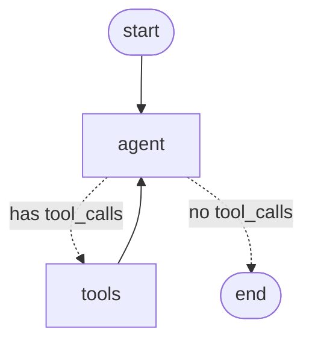

# Commerce Concierge

A stateful, agentic eCommerce assistant built on **LangGraph** — a POC that answers
shopper questions ("where's my order?", "trail runners under $120?") by reasoning over
a catalog and calling backend tools. Full design and roadmap in [DESIGN.md](DESIGN.md).

> **What it demonstrates:** a stateful agentic eCommerce assistant on LangGraph +
> LangChain with Google Vertex AI (Gemini), deployable to GCP Cloud Run — a ReAct agent
> that grounds responses on a product/policy corpus (RAG), calls order/inventory tools,
> and gates output with an automated faithfulness eval.

**Status: Phase 1 complete** — a hand-rolled ReAct graph running against a
deterministic *stub* model, so the LangGraph mechanics run offline with zero API
keys and zero cloud cost. Later phases swap the stub for Vertex Gemini (see
[Roadmap](#roadmap)).

---

## Run it

```bash
uv venv --python 3.11 .venv          # one-time: create the environment
uv pip install -r requirements.txt   # one-time: install pinned deps

.venv/bin/python -m app.cli --demo   # scripted queries, prints the full trace
.venv/bin/python -m app.cli          # interactive chat (Ctrl-C to quit)
.venv/bin/python -m app.cli --graph  # print the graph as a Mermaid diagram
```

Example trace:

```
👤 Where is my order 10432?
  🧠 [agent] decides to call: get_order_status({'order_id': '10432'})
  🔧 [tools] get_order_status returned: {"found": true, "status": "in transit", ...}
  💬 [agent] answers: Order 10432 is **in transit**. Shipped 2 days ago via UPS Ground...
```

## The graph



Dotted edges are the **conditional edge**: after the agent speaks, `tools_condition`
looks at its last message — tool calls present → run the tools and loop back;
otherwise it's a final answer → stop. That branch *is* the ReAct loop.

## LangGraph concepts this project teaches

| Concept | Where | One-liner |
|---|---|---|
| **State + reducer** | [`app/graph.py`](app/graph.py) `State` | `messages` uses the `add_messages` reducer, so nodes *append* to history instead of overwriting it. |
| **Nodes** | `app/graph.py` `agent`, `ToolNode` | Plain functions (or prebuilt helpers) that take state and return a state update. |
| **Conditional edge** | `app/graph.py` `tools_condition` | Picks the next node at runtime from the current state — the reason/act branch. |
| **The ReAct loop** | `agent ↔ tools` wiring | reason → call tool → observe → reason → … → answer. |
| **Tools** | [`app/tools.py`](app/tools.py) | `@tool` turns a typed function + docstring into a schema the model calls. |
| **Model decoupling** | [`app/stub_model.py`](app/stub_model.py) | The model is swappable; the graph never changes. Going live is a one-line edit. |
| **Checkpointing / memory** | `build_graph(... checkpointer=)` + `thread_id` | State persists across turns per `thread_id` — that's multi-turn memory. |

## Layout

```
app/
  graph.py       # the StateGraph: State, agent node, ToolNode, edges, compile
  tools.py       # get_order_status, search_catalog (@tool over mock JSON)
  stub_model.py  # deterministic offline stand-in for Gemini
  cli.py         # run + stream the loop from the terminal
data/            # seeded orders.json, products.json
```

## Roadmap

- [x] **Phase 1** — hand-rolled ReAct graph + 2 tools + stub model + CLI.
- [ ] **Phase 1.5** — swap the stub for `ChatGoogleGenerativeAI(vertexai=True)` (needs a
      billing-safe GCP project + `gcloud auth application-default login`).
- [ ] **Phase 2** — RAG (policy corpus + FAISS) + `get_policy` + `check_inventory` +
      the grounding **gate** node + `SqliteSaver` durable state.
- [ ] **Phase 3** — offline eval harness (golden set + faithfulness / tool-selection).
- [ ] **Phase 4** — FastAPI + Dockerfile + Cloud Run.

---

Built by **Bob Ostronic** — [github.com/rostronic](https://github.com/rostronic) · [linkedin.com/in/rostronic](https://www.linkedin.com/in/rostronic)
