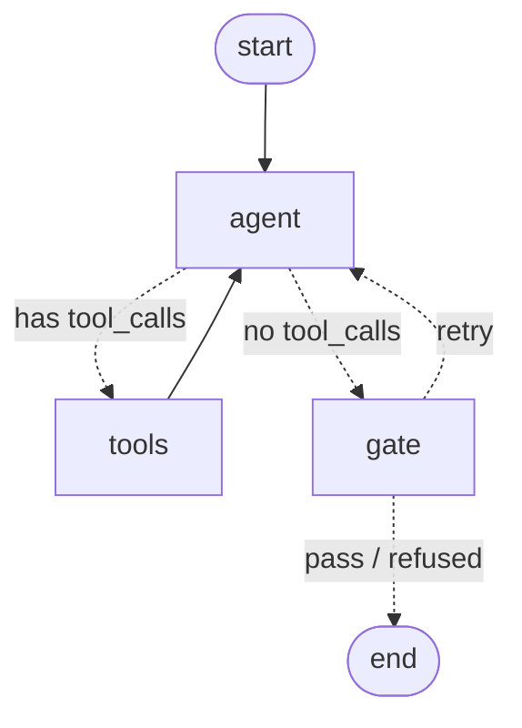

# Commerce Concierge

A stateful, agentic eCommerce assistant built on **LangGraph** — a POC that answers
shopper questions ("where's my order?", "can I return shoes I've worn?") by reasoning
over a catalog, an inventory, and a policy corpus, deciding for itself which to consult.
Full design and roadmap in [DESIGN.md](DESIGN.md).

> **What it demonstrates:** a stateful agentic eCommerce assistant on LangGraph +
> LangChain with Google Gemini, deployable to GCP Cloud Run — a ReAct agent that grounds
> responses on a product/policy corpus (RAG), calls order/inventory tools, and gates
> output with an automated faithfulness eval.

**Status: Phase 2a complete, Phase 2b in progress** — a hand-rolled ReAct graph with
**4 tools**, including **RAG retrieval over a policy corpus (FAISS)**, genuine
**multi-hop** tool use, and a **grounding gate** that checks every draft answer before it
leaves (retry once with reasons, then an honest refusal). It runs two ways: fully offline
against a deterministic stub reasoner *and* stub embeddings (zero keys, zero cost,
byte-identical output), or against live Gemini with `--live`.

---

## Run it

```bash
uv venv --python 3.11 .venv          # one-time: create the environment
uv pip install -r requirements.txt   # one-time: the OFFLINE path, no Google packages

.venv/bin/python -m app.cli --demo         # scripted queries, prints the full trace
.venv/bin/python -m app.cli                # interactive chat (Ctrl-C to quit)
.venv/bin/python -m app.cli --graph        # print the graph as a Mermaid diagram
```

To run the same graph against a real model and real embeddings:

```bash
uv pip install -r requirements.txt -r requirements-live.txt
.venv/bin/python -m app.cli --demo --live
```

`--live` reads `GOOGLE_API_KEY` from a `.env` file — a free
[Google AI Studio](https://aistudio.google.com/app/apikey) key, no GCP project and no
billing. The key stays out of git (`.env` is ignored, and has never been committed).

> **Free-tier quota, measured 2026-09-17:** `gemini-3.8-flash` allows **20
> `generateContent` requests per day**. A full `--demo --live` run makes far more than
> that — six queries, several of which are multi-hop, is 2–5 model calls each — so it
> will 429 partway through. Run `--live` against one or two questions at a time, or pin a
> model with a larger free allowance. This is also a standing argument for the offline
> stub path: the Phase 3 eval harness cannot live on a 20-request budget.

Example trace — note the agent chaining one tool's output into the next call, and the
gate checking the draft before it leaves:

```
👤 Is the Summit hiking boot in stock?
  🧠 [agent] decides to call: search_catalog({'query': 'Is the Summit hiking boot in stock?'})
  🔧 [tools] search_catalog returned: {"results": [{"sku": "HK-BR-11", ...}]}
  🧠 [agent] decides to call: check_inventory({'sku': 'HK-BR-11'})
  🔧 [tools] check_inventory returned: {"total": 0, "in_stock": false, ...}
  💬 [agent] drafts: HK-BR-11 is currently **out of stock** in every warehouse.
  🚦 [gate] pass
```

## The graph



Dotted edges are **conditional edges**. After the agent speaks, `tools_condition` looks
at its last message — tool calls present → run the tools and loop back; otherwise it's a
*draft* → the grounding gate. The gate either lets it out, sends it back once with the
reasons it failed, or replaces it with an honest refusal. The first loop is ReAct; the
second is the gate, and unlike ReAct it is explicitly bounded.

Worth noticing: Phase 2 added two tools and multi-hop reasoning without touching the
graph; Phase 2b added the gate by editing only the *path map* of `tools_condition`, not
the condition itself — "the agent is done reasoning" and "the answer may leave" were
always two different claims.

## The tools

| Tool | Backed by | Notes |
|---|---|---|
| `get_order_status` | seeded `orders.json` | structured lookup by id |
| `search_catalog` | seeded `products.json` | keyword scoring over the catalog |
| `check_inventory` | seeded `inventory.json` | per-warehouse quantities for a SKU |
| `get_policy` | **FAISS retrieval** over `data/policies/*.md` | returns cited passages + a confidence flag |

`get_policy` is deliberately a *retrieval tool* rather than a pre-retrieval step: the
model decides when a question is about the store's rules versus a specific order or
product. That decision is the agentic behaviour worth demonstrating.

## Concepts this project teaches

| Concept | Where | One-liner |
|---|---|---|
| **State + reducer** | [`app/graph.py`](app/graph.py) `State` | `messages` uses the `add_messages` reducer, so nodes *append* to history instead of overwriting it. |
| **Nodes** | `app/graph.py` `agent`, `ToolNode` | Plain functions (or prebuilt helpers) that take state and return a state update. |
| **Conditional edge** | `app/graph.py` `tools_condition` | Picks the next node at runtime from the current state — the reason/act branch. |
| **The ReAct loop** | `agent ↔ tools` wiring | reason → call tool → observe → reason → … → answer. |
| **Multi-hop tool use** | [`app/stub_model.py`](app/stub_model.py) `_next_tool_call` | Re-asks "what's still missing?" after every result; one tool's output becomes the next one's input. |
| **Tools** | [`app/tools.py`](app/tools.py) | `@tool` turns a typed function + docstring into a schema the model reads — the docstring is prompt text, not a comment. |
| **Chunking** | [`app/rag.py`](app/rag.py) `load_policy_chunks` | Split on Markdown headings first (semantic boundaries + free citations), then by size as a safety net. |
| **Embeddings** | `app/rag.py` `HashingEmbeddings` | The interface is two methods, which is why the backend is swappable. |
| **Vector store** | `app/rag.py` `_build_store` | FAISS over normalised vectors, so L2 ranks identically to cosine. |
| **Model decoupling** | `app/stub_model.py`, `app/rag.py` | *Two* swappable models now — reasoner and retriever — varied independently. |
| **Checkpointing / memory** | `build_graph(... checkpointer=)` + `thread_id` | State persists across turns per `thread_id` — that's multi-turn memory. |

## Layout

```
app/
  graph.py       # the StateGraph: State, agent node, ToolNode, edges, compile
  tools.py       # the 4 @tool functions
  rag.py         # chunking, embeddings, FAISS store, retrieval
  gate.py        # grounding gate: judges, retry feedback, bounded refusal (Phase 2b)
  stub_model.py  # deterministic offline stand-in for Gemini
  cli.py         # run + stream the loop from the terminal
data/
  products.json  inventory.json  orders.json
  policies/      # returns, shipping, warranty, sizing (the RAG corpus)
docs/lessons/    # what was learned building each phase
```

## Measured findings

Numbers from this repo, not from a blog post — reproduce them with the snippets in
[docs/lessons/2026-09-17-rag.md](docs/lessons/2026-09-17-rag.md).

- **Hash collisions degrade ranking before anything else does.** At 768 buckets the
  corpus's 246 terms produced 36 collisions and a refund question retrieved
  *"Order processing"* as its top hit. At 16384 buckets: 2 collisions, and top-1
  accuracy went 5/8 → 7/8. Check the representation before blaming the prompt.
- **`faiss.IndexFlatL2` returns the *squared* L2 distance.** Converting it as if it were
  the distance leaves the ranking correct (the transform is monotonic) while every score
  you print or threshold on is wrong — a bug that hides behind plausible output.
- **A similarity threshold cannot decide answerability.** Across 9 in-scope and 7
  out-of-scope questions, in-scope top hits scored 0.188–0.569 and out-of-scope ones
  0.000–0.283. The ranges **overlap**, so no threshold separates them. Cause: short
  chunks score high on almost anything, because cosine normalises length away — every
  out-of-scope question containing the word "policy" retrieved the same three-line
  section at ~0.25.
- **Better embeddings fix ranking, not abstention.** Swapping in `gemini-embedding-001`
  fixed the cases lexical matching cannot reach — *"my sole came apart"* → warranty
  (hash embeddings said *returns*), *"how fast can I get them?"* → expedited shipping
  (hash embeddings scored 0.000, a total miss). But *"can I pay in bitcoin?"* still
  retrieved a shipping section at 0.588. Retrieval scores measure similarity, never
  whether the passage answers the question — which is precisely why Phase 2b adds a
  grounding gate instead of a bigger model.

## Roadmap

- [x] **Phase 1** — hand-rolled ReAct graph + 2 tools + stub model + CLI.
- [x] **Phase 1.5** — live Gemini via `--live` on a free AI Studio key.
- [x] **Phase 2a** — policy corpus + chunking + FAISS + `get_policy` + `check_inventory`
      + multi-hop tool use + offline (`HashingEmbeddings`) / live (`gemini-embedding-001`)
      retrieval.
- [ ] **Phase 2b** — the grounding **gate** node (the finding above is its motivation)
      + `SqliteSaver` durable state. *In progress: the gate is wired into the graph and
      traced in the CLI; the offline judge checks soundness only, so judging relevance
      waits on the LLM judge.*
- [ ] **Phase 3** — offline eval harness (golden set + faithfulness / tool-selection).
- [ ] **Phase 4** — FastAPI + Dockerfile + Cloud Run.

---

Built by **Robert Ostronic** — [github.com/rostronic](https://github.com/rostronic) · [linkedin.com/in/rostronic](https://www.linkedin.com/in/rostronic)
